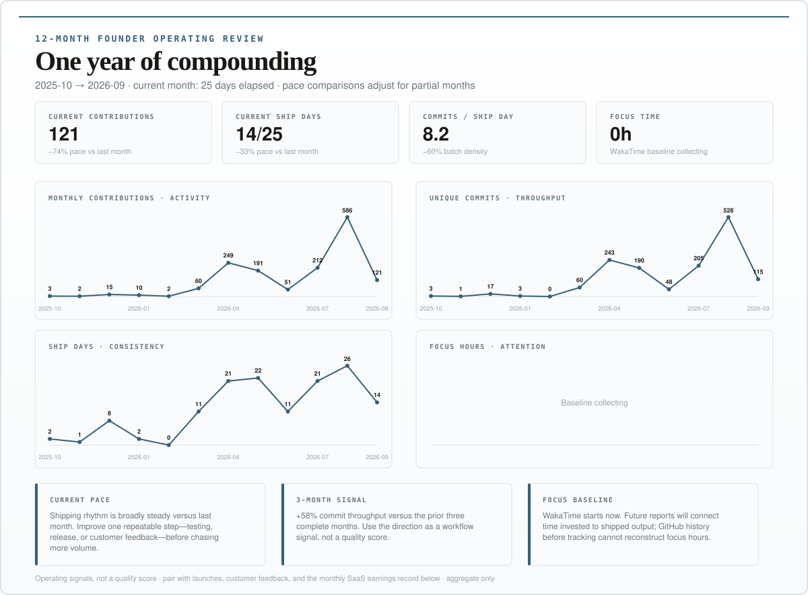
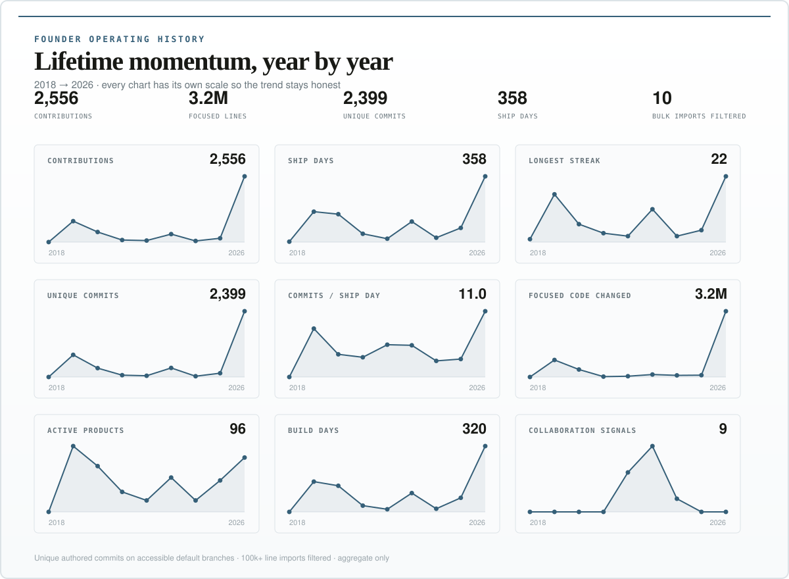

# So — AI-first SaaS founder

I build, launch, measure, and iterate on AI products at founder speed.

<a href="https://github.com/sonozaki7/sonozaki7/blob/main/metrics/latest.json">
  <picture>
    <source media="(max-width: 800px)" srcset="./assets/founder-progress-mobile.svg" />
    
  </picture>
</a>

Updates every day at 00:10 Asia/Bangkok · public and private work is combined without exposing private repository names

## Lifetime operating history

<picture>
  <source media="(max-width: 800px)" srcset="./assets/founder-lifetime-mobile.svg" />
  
</picture>

Year-by-year history from account creation · giant 100k+ line imports are filtered so ordinary shipping work stays visible

## Monthly SaaS earnings

Only includes SaaS.

- 2024
  - Nov: 0 MRR
  - Dec: 0 MRR

- 2025
  - Jan: 0 MRR
  - Feb: 0 MRR
  - Mar: 0 MRR
  - Apr: 0 MRR
  - May: 0 MRR
  - Jun: 0 MRR
  - Jul: 170 MRR
  - Aug: 0 MRR
  - Sep: 0 MRR
  - Oct: 0 MRR
  - Nov: 0 MRR
  - Dec: 0 MRR

- 2026
  - Jan: 0 MRR
  - Feb:
  - Mar:
  - Apr:
  - May:
  - Jun:
  - Jul:
  - Aug:
  - Sep:
  - Oct:
  - Nov:
  - Dec:

- 2027
  - Jan:
  - Feb:
  - Mar:
  - Apr:
  - May:
  - Jun:
  - Jul:
  - Aug:
  - Sep:
  - Oct:
  - Nov:
  - Dec:

- 2028
  - Jan:
  - Feb:
  - Mar:
  - Apr:
  - May:
  - Jun:
  - Jul:
  - Aug:
  - Sep:
  - Oct:
  - Nov:
  - Dec:

## Share the momentum

The workflow also refreshes a social-ready [`founder-progress.png`](./assets/founder-progress.png) and [`share-copy.txt`](./assets/share-copy.txt). Download both whenever you want to post the latest build streak on X.

How this tracker works

The tracker runs from this repository with a daily GitHub Action. It reads GitHub contribution totals and commit diff statistics, then produces the profile graphics and machine-readable [`latest.json`](./metrics/latest.json) and [`history.json`](./metrics/history.json). Private activity is included only in aggregate. Repository names, commit messages, source code, and secrets are never written into the generated files or retained in tracker history.

The public tracker emphasizes shipping consistency, unique commits, active-product breadth, and focused code movement. It deduplicates identical commits and filters individual 100k+ line imports or generated snapshots from line totals so a handful of bulk operations cannot dominate years of ordinary work. Those commits still count as commits.

Metrics include authored commits from accessible, non-archived repositories on each repository's default branch. Unpushed work and commits that only exist on other branches are not included.

Lines changed are a momentum signal, not a quality score. Shipping useful product remains the goal.

